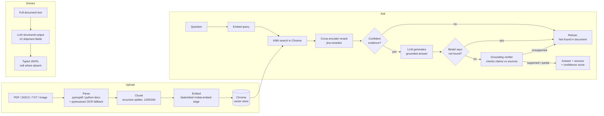

# UltraDoc AI

Document intelligence for logistics paperwork: upload a rate confirmation,
bill of lading, or similar PDF/DOCX/TXT/image document, ask questions about it
with cited sources and a confidence score, and extract structured shipment
fields.

## Overview

- **Upload** → parse → chunk → embed → store in a local vector index.
- **Ask** → retrieve the most relevant chunks, generate a grounded answer, and
  return the answer with its supporting source text and a confidence score.
  Three guardrail layers keep answers honest, including refusing to answer
  when the document doesn't contain the information.
- **Extract** → pull 13 structured shipment fields (pickup/delivery location,
  dates, PO number, commodity, weight, rate, etc.) out of the document as
  typed JSON, with `null` for anything not explicitly present. Field
  selection follows what's actually repetitive across real logistics
  paperwork: reference ID, pickup/delivery location, pickup/delivery date,
  PO number, commodity, weight, and quantity appear on essentially every
  bill of lading and rate confirmation; equipment type, rate, currency, and
  carrier name are common on rate confirmations but typically absent from a
  bill of lading.

LLM inference runs through a single OpenAI-compatible client — **Groq** by
default, or any self-hosted **Ollama** server exposing an `/v1` endpoint, with
no code changes required to switch. Embeddings and reranking run **locally**
via [fastembed](https://github.com/qdrant/fastembed) — no cloud embedding key
needed. Scanned PDF pages and image uploads (PNG/JPG/WEBP) are OCR'd locally
via [pytesseract](https://github.com/madmaze/pytesseract) — no cloud vision
API needed either.

## Quickstart

Prerequisites: [uv](https://docs.astral.sh/uv/), [pnpm](https://pnpm.io/),
Python 3.12, Node 22, and the `tesseract-ocr` binary (`brew install
tesseract` on macOS, `apt-get install tesseract-ocr` on Debian/Ubuntu — the
Docker image installs it automatically).

```bash
# Backend
cd apps/api
cp .env.example .env          # fill in LLM_API_KEY (Groq key, or leave blank for Ollama)
uv sync
uv run python scripts/make_sample_docs.py   # generates sample logistics docs
uv run python scripts/prefetch_models.py    # downloads embedding + reranker models (~800MB, one-time)
uv run uvicorn app.main:app --reload --port 8000

# Frontend (new terminal)
cd apps/web
cp .env.example .env.local
pnpm install
pnpm dev
```

Open http://localhost:3000, upload a document, and start asking questions.

Or from the repo root: `pnpm dev:api` / `pnpm dev:web` (see [package.json](package.json)).

### Using Ollama instead of Groq

Set in `apps/api/.env`:

```bash
LLM_BASE_URL=http://localhost:11434/v1
LLM_API_KEY=ollama
LLM_MODEL=llama3.1
```

The same code path (`app/llm/client.py`) serves both providers — Groq and
Ollama both speak the OpenAI chat-completions API.

## Architecture



## API reference

All endpoints are root-level (no version prefix).

### `POST /upload`

Multipart form with a `file` field (PDF, DOCX, TXT, PNG, JPG, or WEBP, max
10MB by default). Scanned PDF pages and image files are OCR'd via
pytesseract before chunking.

```json
{
  "document_id": "a1b2c3d4e5f6...",
  "filename": "rate_confirmation.pdf",
  "pages": 1,
  "chunk_count": 3,
  "status": "ready"
}
```

Re-uploading identical bytes returns the same `document_id` (content-hash
dedupe) instead of re-processing.

### `POST /ask`

```json
{ "question": "What is the agreed rate?", "document_id": "a1b2c3d4e5f6..." }
```

`document_id` is optional — omitted, it defaults to the most recently
uploaded document.

```json
{
  "answer": "The agreed rate is $2,450.00 USD.",
  "refused": false,
  "sources": [
    { "text": "...", "page": 1, "chunk_index": 0, "score": 0.82 }
  ],
  "confidence": 0.91,
  "confidence_tier": "high",
  "confidence_breakdown": { "retrieval": 0.95, "agreement": 1.0, "grounding": 1.0 },
  "model": "llama-3.3-70b-versatile"
}
```

### `POST /extract`

```json
{ "document_id": "a1b2c3d4e5f6..." }
```

```json
{
  "document_id": "a1b2c3d4e5f6...",
  "data": {
    "reference_id": "LD53657",
    "pickup_location": "AAA, Los Angeles International Airport (LAX), World Way, Los Angeles, CA, USA",
    "delivery_location": "xyz, 7470 Cherry Avenue, Fontana, CA 92336, USA",
    "pickup_date": "2026-02-08T09:00:00",
    "delivery_date": "2026-02-08T09:00:00",
    "po_number": "112233ABC",
    "commodity": "Ceramic",
    "weight": 56000,
    "quantity": "10000 units",
    "equipment_type": "Flatbed",
    "rate": 400,
    "currency": "USD",
    "carrier_name": "SWIFT SHIFT LOGISTICS LLC"
  }
}
```

Every field is `null` when not explicitly present in the document — the
extraction prompt is instructed never to infer or guess a value.

### Extras

- `GET /documents` — every uploaded document, most recently uploaded first.
- `GET /health` — liveness probe.

## Chunking strategy

Each page is split independently with a recursive character splitter
(paragraph → sentence → word → character boundaries), 1200 characters per
chunk with 200 characters of overlap (`app/rag/chunking.py`,
`app/constants/rag.py`). Splitting per-page (rather than across page breaks)
keeps every chunk's `page` metadata exact. DOCX tables — rate confirmations
are table-heavy — are row-joined (`"Cell A | Cell B"`) and appended after the
running paragraph text so structured fields inside tables aren't lost.

## Retrieval

1. Embed the query with the same `mxbai-embed-large-v1` model used for
   passages (with its asymmetric query instruction prefix).
2. ANN search the Chroma collection, filtered to the target document, cosine
   space, top 12 candidates.
3. Cross-encoder rerank (`jina-reranker-v1-turbo-en`) over those candidates.
4. Blend: `score = 0.6 · rerank_norm + 0.4 · cosine_norm`.
5. Mark each chunk **confident** if its raw cosine or raw rerank logit clears
   an absolute bar (not just relative rank) — catches cases where the two
   signals disagree.
6. Cap non-confident ("weak") chunks at 4 so an unanswerable query doesn't
   return a full page of noise, and drop any chunk scoring below 40% of the
   top score (relevance dropoff).

All thresholds live in `app/constants/rag.py`.

## Guardrails

Three layers, in order:

1. **Pre-generation refusal** — if no retrieved chunk is confident, or the
   top blended score is below `REFUSAL_FLOOR` (0.3), the request refuses
   immediately with `"Not found in document."` and **never calls the LLM**
   (saves latency and cost on obviously unanswerable questions).
2. **Grounded system prompt** — the LLM is instructed to answer only from the
   provided context, treat that context as untrusted data (not instructions —
   a prompt-injection guard for content embedded in the document), and to
   respond with the exact refusal string when the context doesn't answer the
   question.
3. **Post-generation grounding verifier** — a second, independent LLM call
   checks the generated answer's claims against the retrieved source text and
   returns a verdict (`supported` / `partially_supported` / `unsupported`).
   An `unsupported` verdict flips the answer to a refusal even if the first
   model produced fluent text. The verifier call has an 8-second timeout; on
   timeout or a malformed response it degrades to a neutral confidence factor
   rather than blocking the request (`app/guardrails/grounding.py`).

## Confidence scoring

```
confidence = 0.5 · retrieval + 0.2 · agreement + 0.3 · grounding
```

- **retrieval** — the top chunk's blended relevance score.
- **agreement** — fraction of returned chunks that were marked confident.
- **grounding** — 1.0 supported / 0.6 partially supported / 0.2 unsupported /
  0.5 neutral (verifier didn't run).

Tiers: `high` ≥ 0.75, `medium` ≥ 0.5, else `low`. The `confidence_breakdown`
field in every `/ask` response exposes the three components separately so the
UI (and this README) can explain *why* a score landed where it did, not just
the final number.

**Calibration note:** these weights and thresholds were tuned against the two
sample documents in `data/samples/` and the golden eval below. They are a
reasonable starting point, not a universally correct answer — recalibrate
against a larger, more diverse document set before relying on this in
production.

## Structured extraction

The full document text (all pages concatenated, capped at 60k characters —
well within Groq's 128k context) is sent to the LLM with a structured-output
schema for the 13 shipment fields. The prompt instructs the model to return a
field only if it is explicitly present in the text, `null` otherwise, and to
normalize dates to ISO 8601. This is the same "never guess" instruction style
used for the `/ask` refusal guardrail, applied to structured output.

## Eval results

`scripts/run_eval.py` runs a small golden Q&A set (`scripts/eval_golden.yaml`)
against the two generated sample documents — a mix of answerable questions,
deliberately unanswerable questions (things not in the document), and a
cross-document question — and checks refusal behavior and answer correctness.

```
Question                                               Result     Check  Tier
-------------------------------------------------------------------------------
What is the agreed rate for this shipment?             answered   PASS   high
Who is the carrier?                                    answered   PASS   high
What is the pickup date and time?                      answered   PASS   high
What is the total weight of the shipment?               answered   PASS   high
Who is the CEO of the shipper company?                  refused    PASS   high
What is the weather forecast for the delivery city?     refused    PASS   high
What is the carrier name?                               answered   PASS   high
What is the agreed rate for this shipment?               refused    PASS   high
-------------------------------------------------------------------------------
Accuracy: 8/8 (100%)
```

Re-run after any threshold change: `cd apps/api && PYTHONPATH=. uv run python scripts/run_eval.py`.

## Failure cases

- **Low-quality scans / images** — pytesseract OCR runs on scanned PDF pages
  and image uploads, but a blurry photo, skewed scan, or handwriting can still
  yield zero readable text, in which case `/upload` returns a 422 ("No
  extractable text found").
- **Cross-document questions** — `/ask` is scoped to a single `document_id`;
  a question spanning two uploaded documents will only see one of them (or
  whichever is "latest" if `document_id` is omitted).
- **Ambiguous or locale-formatted dates** — the extraction prompt normalizes
  to ISO 8601 on a best-effort basis; genuinely ambiguous dates (`03/04/2026`)
  may be mis-parsed as month/day vs. day/month.
- **Table-mangled text** — pymupdf's plain-text extraction usually preserves
  reading order, but densely nested tables can interleave columns; DOCX table
  handling is explicit (row-joined), but PDF tables rely on pymupdf's default
  layout heuristics with no `find_tables()` fallback yet.
- **Very short documents** — a one-page, one-chunk document (like the sample
  rate confirmation) has only one candidate for retrieval, so the "cap weak
  results" and "relevance dropoff" logic have little to work with; guardrail
  behavior is still correct but less meaningfully exercised.

## Improvement ideas

- Stream `/ask` responses over SSE instead of returning the full answer at once.
- Hybrid retrieval (dense + BM25) fused with reciprocal rank fusion, for
  documents where keyword match matters more than semantic similarity.
- Table-aware PDF parsing (`page.find_tables()`) instead of relying on plain
  text extraction order.
- Distill or fine-tune a smaller reranker for lower latency at scale.
- Multi-tenant hosting: swap the embedded Chroma `PersistentClient` for a
  server-mode deployment, and the filesystem document registry for a proper
  database, once this moves beyond a single-user local deployment.

## Project structure

```
apps/
  api/    FastAPI backend — see apps/api/app for the module layout
  web/    Next.js frontend — see apps/web/src/features/doc-chat
```

## Development

```bash
# Backend gates
cd apps/api && uv run ruff check . && uv run mypy app

# Frontend gates
cd apps/web && pnpm lint && pnpm type-check
```
