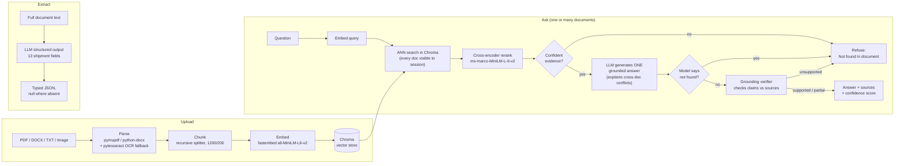
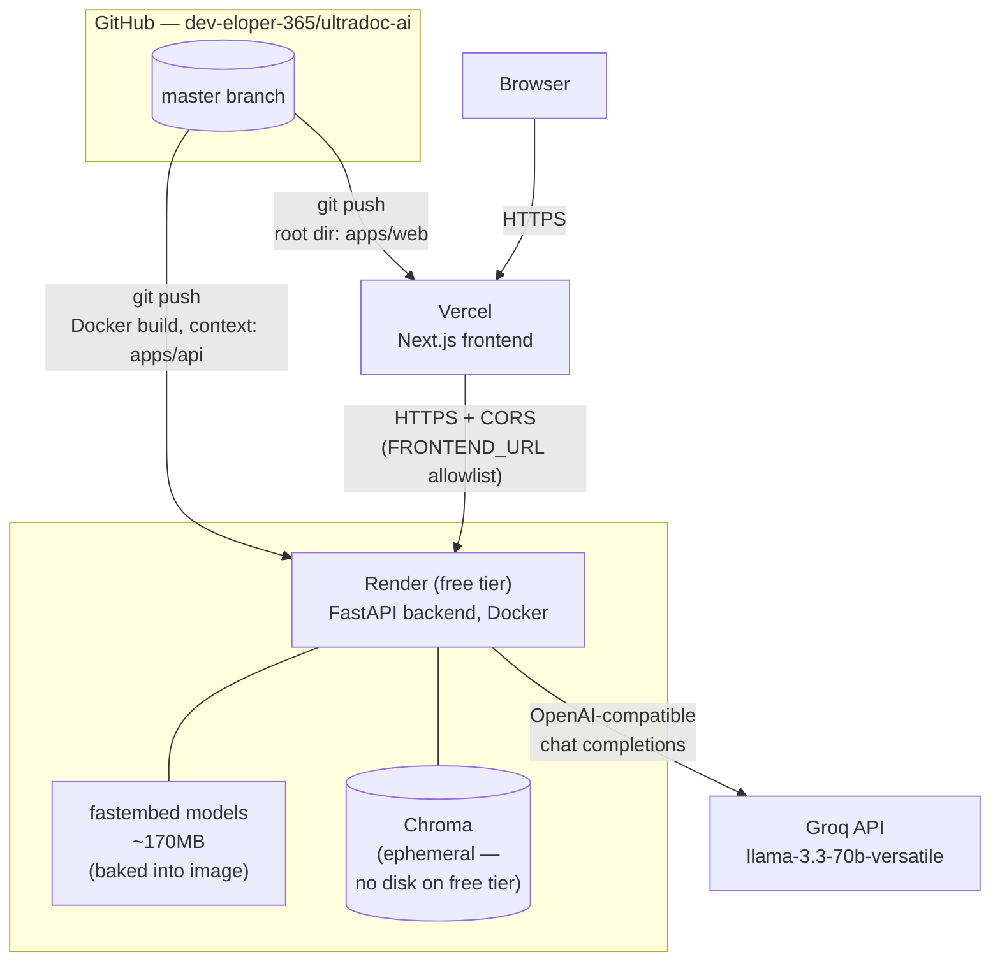
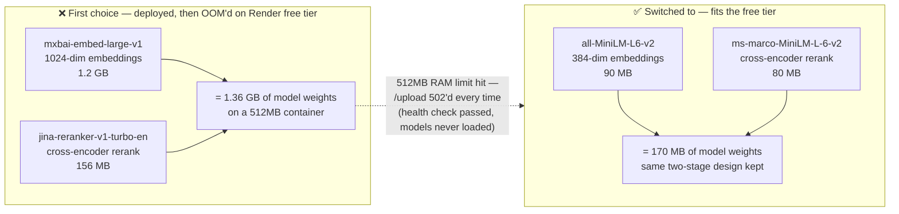

# UltraDoc AI

Document intelligence for logistics paperwork: upload a rate confirmation,
bill of lading, or similar PDF/DOCX/TXT/image document, ask questions about
it (across one document or many, with cited sources and a confidence score),
and extract structured shipment fields.

**Live:** [ultradoc-ai.vercel.app](https://ultradoc-ai.vercel.app) · API:
`https://ultradoc-api.onrender.com`

## Overview

- **Upload** → parse → chunk → embed → store in a local vector index.
- **Ask** → retrieve the most relevant chunks across every document visible
  to the session, generate a grounded answer, and return it with supporting
  source text and a confidence score. If the question's evidence spans more
  than one document, the model synthesizes **one** answer that names each
  document's value and explains any real discrepancy — it never blocks on
  "which document did you mean?" and never splits the answer into one block
  per document. Three guardrail layers keep answers honest, including
  refusing outright when no uploaded document contains the information.
- **Extract** → pull 13 structured shipment fields (pickup/delivery location,
  dates, PO number, commodity, weight, rate, etc.) out of one or many
  documents as typed JSON, with `null` for anything not explicitly present.
  Field selection follows what's actually repetitive across real logistics
  paperwork: reference ID, pickup/delivery location, pickup/delivery date, PO
  number, commodity, weight, and quantity appear on essentially every bill of
  lading and rate confirmation; equipment type, rate, currency, and carrier
  name are common on rate confirmations but typically absent from a bill of
  lading.

LLM inference runs through a single OpenAI-compatible client — **Groq** by
default, or any self-hosted **Ollama** server exposing an `/v1` endpoint, with
no code changes required to switch. Embeddings and reranking run **locally**
via [fastembed](https://github.com/qdrant/fastembed) — no cloud embedding key
needed. Scanned PDF pages and image uploads (PNG/JPG/WEBP) are OCR'd locally
via [pytesseract](https://github.com/madmaze/pytesseract) — no cloud vision
API needed either.

## Quickstart

Prerequisites: [uv](https://docs.astral.sh/uv/), [pnpm](https://pnpm.io/),
Python 3.12, Node 22+, and the `tesseract-ocr` binary (`brew install
tesseract` on macOS, `apt-get install tesseract-ocr` on Debian/Ubuntu — the
Docker image installs it automatically). Or skip all of that and use
[mise](https://mise.jdx.dev/) (see below).

```bash
# Backend
cd apps/api
cp .env.example .env          # fill in LLM_API_KEY (Groq key, or leave blank for Ollama)
uv sync
uv run python scripts/make_sample_docs.py   # generates sample logistics docs
uv run python scripts/prefetch_models.py    # downloads embedding + reranker models (~170MB, one-time)
uv run uvicorn app.main:app --reload --port 8000

# Frontend (new terminal)
cd apps/web
cp .env.example .env.local
pnpm install
pnpm dev
```

Open http://localhost:3000, upload a document, and start asking questions.

### One-command dev with mise

```bash
mise install      # pins python/node/pnpm/uv to the versions in mise.toml
mise run dev       # runs backend + frontend together, interleaved output
```

Or the plain npm-script equivalents from the repo root: `pnpm dev:api` /
`pnpm dev:web` (see [package.json](package.json)).

### Using Ollama instead of Groq

Set in `apps/api/.env`:

```bash
LLM_BASE_URL=http://localhost:11434/v1
LLM_API_KEY=ollama
LLM_MODEL=llama3.1
```

The same code path (`app/llm/client.py`) serves both providers — Groq and
Ollama both speak the OpenAI chat-completions API.

## Architecture



## Deployment architecture



A full editable diagram source is at
[`docs/architecture.drawio`](docs/architecture.drawio) (open in
[draw.io](https://app.diagrams.net) or the VS Code draw.io extension).

Notable deployment-specific decisions, in case you're standing this up
yourself:

- **Vercel project root is `apps/web`**, not the repo root — this is a
  monorepo with two independent lockfiles. The Vercel *Root Directory*
  project setting has to point at `apps/web` explicitly; otherwise Vercel
  clones the whole repo, finds no `build` script at the top level, and
  silently produces an empty deployment (build "succeeds" in ~50ms, then
  every route 404s). A `.vercelignore` at the repo root excludes `apps/api`
  entirely (546MB `.venv` + up to ~1.4GB of local model-cache/vector-store
  data accumulated during dev — none of it relevant to the frontend build,
  and Vercel's local-upload path doesn't fully honor `.gitignore` for a
  monorepo the way `git` itself does).
- **Framework Preset must be set explicitly to `Next.js`.** A freshly created
  Vercel project defaults to `Other`, which runs the build step fine (the
  local `vercel build` invocation auto-detects Next.js and produces correct
  output) but the *platform* doesn't register the deployment as a Next.js
  app for routing purposes — every route 404s at the edge layer despite a
  successful build. This one is easy to miss because the build logs look
  completely normal.
- **Deployment Protection (Vercel SSO)** is on by default for a new project
  and gates every URL — including production — behind a Vercel login wall.
  Turn it off (`vercel project protection disable <project> --sso`) for a
  public-facing app.
- **CORS is two-sided.** The frontend's `NEXT_PUBLIC_API_BASE_URL` has to
  point at the Render URL, *and* the backend's `FRONTEND_URL` has to point
  back at the Vercel URL (`app_factory.py` builds its CORS allowlist from
  it). Getting one side right and not the other produces a confusing partial
  failure: `curl` against the API works fine (curl doesn't enforce CORS),
  but the browser blocks every request with "No 'Access-Control-Allow-Origin'
  header," which looks like a backend bug until you check both env vars.
- **Render's free tier has no persistent disk.** Uploaded files and the
  Chroma index live on the container's ephemeral filesystem and are wiped on
  every restart or redeploy — acceptable for a demo, not for real use. See
  [`render.yaml`](render.yaml) for the "bump plan + add a disk block" path
  back to persistence.

## API reference

All endpoints are root-level (no version prefix). Send an `X-Session-Id`
header (any client-generated string) to scope uploaded documents to that
session; omit it and every endpoint operates unscoped (every document ever
uploaded to the instance — this is the "direct API/script caller" path, not
what the web UI does).

### `POST /upload`

Multipart form with a `file` field (PDF, DOCX, TXT, PNG, JPG, or WEBP, max
10MB by default). Scanned PDF pages and image files are OCR'd via
pytesseract before chunking. `POST /upload/batch` (`files[]`, multiple)
uploads several documents in one request, isolating per-file failures.

```json
{
  "document_id": "11a6837c0058558a",
  "filename": "rate_confirmation.pdf",
  "pages": 2,
  "chunk_count": 4,
  "status": "ready"
}
```

Re-uploading identical bytes returns the same `document_id` (content-hash
dedupe) instead of re-processing.

### `POST /ask`

```json
{ "question": "What is the agreed rate?", "document_ids": null, "history": null }
```

`document_ids` is optional — omitted (or empty), retrieval searches every
document visible to the session and the model synthesizes one answer,
naming which document each fact came from when they disagree.  `document_ids`
given, the question is scoped to just those (intersected with what the
session can actually see — see [Security](#security)). `history` is the
client's own recent chat turns (`[{"role": "user"|"assistant", "content":
str}]`), used only to resolve follow-ups like "what about the delivery date
instead?" — never as a source of facts.

```json
{
  "answer": "- Reference ID: LD53657",
  "refused": false,
  "sources": [
    {
      "text": "...Reference ID\nLD53657\nPhone\n+919884954552...",
      "page": 2,
      "chunk_index": 3,
      "score": 0.681,
      "document_id": "11a6837c0058558a",
      "filename": "LD53657-Carrier-RC.pdf"
    }
  ],
  "confidence": 0.841,
  "confidence_tier": "high",
  "confidence_breakdown": { "retrieval": 0.681, "agreement": 1.0, "grounding": 1.0 },
  "model": "llama-3.3-70b-versatile"
}
```
*(a real response, captured from the live Render deployment)*

### `POST /extract`

```json
{ "document_ids": null }
```

Same scoping rule as `/ask` — omitted extracts from every document visible
to the session; one result per document either way.

```json
{
  "results": [
    {
      "document_id": "11a6837c0058558a",
      "filename": "LD53657-Carrier-RC.pdf",
      "data": {
        "reference_id": "LD53657",
        "pickup_location": "AAA, Los Angeles International Airport (LAX), World Way, Los Angeles, CA, USA",
        "delivery_location": "xyz, 7470 Cherry Avenue, Fontana, CA 92336, USA",
        "pickup_date": "2026-02-08",
        "delivery_date": "2026-02-08",
        "po_number": "112233ABC",
        "commodity": "Ceramic",
        "weight": 56000,
        "quantity": "10000 units",
        "equipment_type": "Flatbed",
        "rate": 400,
        "currency": "USD",
        "carrier_name": "SWIFT SHIFT LOGISTICS LLC"
      },
      "error": null
    }
  ]
}
```

Every field is `null` when not explicitly present in the document — the
extraction prompt is instructed never to infer or guess a value, including
never fabricating a time-of-day onto a date the document only gives as a
bare date (a real bug this session caught and fixed — see
[Failure cases found and fixed](#failure-cases-found-and-fixed)).

### Extras

- `GET /documents` — every document visible to the session, most recently
  uploaded first.
- `GET /documents/{id}/file` — the original uploaded bytes, for inline
  preview. Always requires a session that can see that document — the one
  endpoint that does *not* fall back to unscoped access with no
  `X-Session-Id` (see [Security](#security)).
- `GET /health` — liveness probe.

## Chunking strategy

Each page is split independently with a recursive character splitter
(paragraph → sentence → word → character boundaries), 1200 characters per
chunk with 200 characters of overlap (`app/rag/chunking.py`,
`app/constants/rag.py`). Splitting per-page (rather than across page breaks)
keeps every chunk's `page` metadata exact. DOCX tables — rate confirmations
are table-heavy — are row-joined (`"Cell A | Cell B"`) and appended after the
running paragraph text so structured fields inside tables aren't lost.

## Retrieval

1. Embed the query with the same embedding model used for passages (with its
   asymmetric query-instruction prefix).
2. ANN search the Chroma collection — every document visible to the session
   unless `document_ids` scopes it — cosine space, top 12 candidates.
3. Cross-encoder rerank over those candidates.
4. Blend: `score = 0.6 · rerank_norm + 0.4 · cosine_norm`.
5. Mark each chunk **confident** if its raw cosine *or* raw rerank logit
   clears an absolute bar (not just relative rank) — catches cases where the
   two signals disagree.
6. Cap non-confident ("weak") chunks at 4 so an unanswerable query doesn't
   return a full page of noise, and drop any chunk scoring below 15% of the
   top score (relevance dropoff — see the calibration note below for why
   this isn't 40% anymore).

All thresholds live in `app/constants/rag.py`.

### The embedding/reranker model, and why it changed



**First choice:** `mxbai-embed-large-v1` (1024-dim embeddings) +
`jina-reranker-v1-turbo-en` (cross-encoder) — both run locally via fastembed,
chosen for retrieval quality on the assumption that this would run on a
normal machine with normal RAM. Worked well in local dev the entire time
this project was built.

**What broke:** deploying the backend to Render's free tier (512MB RAM) for
a public demo. `GET /health` kept passing — it never touches the ML models —
which made the service *look* fine. Every real request (`/upload`, `/ask`,
`/extract`) 502'd, because the container OOM-crashed the moment it tried to
load the models. `du -sh` on the local model cache made the reason obvious:

```
1.2G  models--mixedbread-ai--mxbai-embed-large-v1
156M  models--jinaai--jina-reranker-v1-turbo-en
```

1.36GB of model weights alone, before FastAPI/Chroma/Python's own baseline —
on a 512MB container. Not a logic bug, a capacity mismatch.

**The switch:** queried fastembed's own model catalog
(`TextEmbedding.list_supported_models()` /
`TextCrossEncoder.list_supported_models()`) for the smallest options that
kept the *same two-stage architecture* (dense retrieval + cross-encoder
rerank) rather than dropping the reranker outright, since reranking had
already proven to catch cases in eval testing where raw cosine similarity
ranked the wrong chunk first:

```
sentence-transformers/all-MiniLM-L6-v2   — 0.09 GB  (embedding)
Xenova/ms-marco-MiniLM-L-6-v2            — 0.08 GB  (reranker)
```

~170MB combined vs. 1.36GB — comfortably under 512MB with room for request-
time overhead.

**The part that isn't free:** the smaller models produce a *materially
different, more compressed* raw score distribution than the originals — this
isn't just "somewhat lower everywhere," it's a different shape. Measured
directly (a real query, retrieval and reranking called in isolation,
bypassing the LLM entirely) on the exact same document and question:

| | old models | new models |
|---|---|---|
| top cosine similarity | ~0.4–0.9 typical | **0.24** (this query's ceiling) |
| reranker logit, relevant chunk | needed to clear **-2.5** | clustered at **-5.8 to -6.0** |
| reranker logit, irrelevant chunk | — | **-11 to -11.5** |

The old `CONFIDENT_COSINE` (0.55) and `CONFIDENT_RERANK_LOGIT` (-2.5)
thresholds were calibrated for the old models' range and were *unreachable*
by the new models on this query — every chunk silently scored
"not confident," capping the `agreement` component of every answer's
confidence at 0 even when the answer itself was correct (confidence dropped
from `high` to `medium` across the board, despite content quality holding).
Recalibrated to `CONFIDENT_COSINE = 0.20` and `CONFIDENT_RERANK_LOGIT = -7.0`
— set just past the real relevant/irrelevant cluster boundary measured
above, not guessed — and re-verified against the same eval queries (4/4
still correct, confidence tiers back to reading `high` for clean matches).

**What this doesn't fix:** this is one measurement on one query, not a
statistically rigorous recalibration across a large, diverse eval set. If
you're deploying this for real (not a demo), re-run a broad eval batch
against the smaller models and re-tune from there — or just pay for enough
RAM to run the bigger models and skip this tradeoff entirely.

## Guardrails

Three layers, in order:

1. **Pre-generation refusal** — if no retrieved chunk is confident, or the
   top blended score is below `REFUSAL_FLOOR` (0.3), the request refuses
   immediately with `"Not found in document."` and **never calls the LLM**
   (saves latency and cost on obviously unanswerable questions).
2. **Grounded system prompt** — the LLM is instructed to answer only from the
   provided context, treat that context (and conversation history) as
   untrusted data rather than instructions (a prompt-injection guard for
   content embedded in the document, or in a user message trying to get the
   model to ignore its instructions), and to respond with the exact refusal
   string when the context doesn't answer the question. This prompt grew
   substantially through eval-driven testing this session — see
   [Failure cases found and fixed](#failure-cases-found-and-fixed) for the
   concrete failures that each addition closes.
3. **Post-generation grounding verifier** — a second, independent LLM call
   checks the generated answer's claims against the retrieved source text and
   returns a verdict (`supported` / `partially_supported` / `unsupported`).
   An `unsupported` verdict flips the answer to a refusal even if the first
   model produced fluent text. The verifier call has an 8-second timeout; on
   timeout or a malformed response it degrades to a neutral confidence factor
   rather than blocking the request (`app/guardrails/grounding.py`).

## Confidence scoring

```
confidence = 0.5 · retrieval + 0.2 · agreement + 0.3 · grounding
```

- **retrieval** — the top chunk's blended relevance score.
- **agreement** — fraction of returned chunks that were marked confident.
- **grounding** — 1.0 supported / 0.6 partially supported / 0.2 unsupported /
  0.5 neutral (verifier didn't run).

Tiers: `high` ≥ 0.75, `medium` ≥ 0.5, else `low`. The `confidence_breakdown`
field in every `/ask` response exposes the three components separately so
the UI can explain *why* a score landed where it did, not just the final
number — and so a hallucinated-sounding "89% confident" next to a non-answer
is catchable (that pattern is treated as an anti-pattern in the frontend: a
refusal never shows a percentage at all, see
`ConfidenceScore.tsx`).

**Calibration note:** these weights and thresholds were tuned against the
sample documents in `sample/` and the eval rounds described below — a
reasonable starting point, not a universally correct answer. They were
already re-tuned once this session (see the embedding/reranker section
above); recalibrate again against a larger, more diverse document set before
relying on this in production.

## Structured extraction

The full document text (all pages concatenated, capped at 60k characters —
well within Groq's 128k context) is sent to the LLM with a structured-output
schema for the 13 shipment fields. The prompt instructs the model to return a
field only if it is explicitly present in the text, `null` otherwise, and to
normalize dates to ISO 8601 *using only the precision the document actually
gives* — this exact wording exists because the first version fabricated
`T00:00:00` onto date-only fields (see below).

## Failure cases found and fixed

The RAG answer-quality work happened as an iterative eval loop
(`EVAL_LOOP.md`): generate a batch of questions across every 1/2/3-document
upload combination, write reference answers grounded in the actual sample
PDFs, run them against the live API, score retrieval and answer quality
independently, and fix what's wrong. A few rounds of that turned up real
bugs, not hypothetical ones:

- **Hallucinated a checkbox selection.** A "Freight Charges: Collect / COD /
  Prepaid" field with no visual mark distinguishing the three options —
  asked which applied, the model confidently answered "Collect" with high
  confidence, inventing a selection the text gives no evidence for. Fixed by
  explicitly telling the prompt that plain reading order isn't a selection
  marker.
- **Answered from a placeholder instead of the real content.** A document
  had both a real `carrier instructions: No weekend pickups...` line *and* a
  separately titled `Test RC Instructions` placeholder section. Asked "what
  are the RC instructions," the model answered from the placeholder — its
  title lexically matched the question's wording more closely than the real
  content did. Needed **three prompt iterations** before it reliably held: an
  abstract "prefer substance over placeholder" rule didn't work, a
  domain-specific version didn't fully work, and a concrete worked example
  mirroring the exact failure finally did. (This pattern repeated across
  several fixes this session — this model responds far more reliably to a
  concrete example than an abstract rule.)
- **Wrong-party attribution.** Asked "what's the customer's agreed amount"
  with only the carrier's rate confirmation uploaded (no shipper document),
  the model answered with the carrier's amount — the only "Agreed Amount"
  field in context, under a "Carrier Details" table, silently reused for a
  different party's question. Fixed by teaching the prompt that a value
  belongs to whichever section header it's actually under, regardless of the
  question's generic wording.
- **Stretched an unrelated sentence to answer a question.** Asked "what are
  the carrier instructions" against a document that genuinely had no such
  section, the model built an answer out of a generic pickup description
  that happened to contain the word "instructions" in passing ("follow
  on-site instructions at arrival"). Correct behavior is a refusal; needed
  the same concrete-example treatment as above.
- **Over-refused an explicit `N/A` value.** A document's `Class` field
  literally read `N/A`. Asked "what class is the commodity," the model
  refused with "Not found in document." — technically the field wasn't a
  *found* value, but `N/A` is the document's real, deliberate answer, not an
  absence. Fixed by treating an explicit `N/A`/`None`/`-` as data to report,
  not grounds for refusal.
- **Retrieval discarded the right chunk before the LLM ever saw it.** Asked
  about equipment type against a document with no field literally labeled
  "Equipment" (just `Flatbed:$1000.00 USD` inside a rate breakdown), the
  request refused — not a generation problem this time. Direct inspection
  (`retrieve()` and `rerank()` called in isolation, bypassing the LLM) showed
  retrieval *did* surface the chunk, but `RELEVANCE_DROPOFF_RATIO` (then 0.4)
  discarded it: with only 2 candidate chunks for that document, min-max
  normalization stretched a small raw-score gap into a full 0–1 spread,
  making a legitimately relevant #2 chunk look artificially worthless. Fixed
  by dropping the ratio to 0.15 — verified with a broad regression sweep
  since this constant affects every single query, not just the failing one.
- **Authorization bypass — explicit `document_ids` skipped session
  scoping.** Found by an automated security review right before the public
  deploy, not the eval loop. `/ask` and `/extract` both used a
  caller-supplied `document_ids` list directly with no check that those IDs
  belonged to the requesting session. Since `document_id` is just a content
  hash (visible in every `/upload` response, not a secret), any session
  could pull Q&A answers or extracted data out of a document a *different*
  session uploaded, just by naming its ID. A companion endpoint
  (`GET /documents/{id}/file`, serving raw file bytes) had a related gap:
  it fell back to *unscoped* access whenever the caller simply omitted
  `X-Session-Id` — since that header is entirely client-controlled with no
  server-side verification, "no header" is indistinguishable from "attacker
  stripped the header on purpose." Fixed by intersecting `document_ids`
  against the session's actually-visible documents, and requiring a session
  unconditionally for the raw-file endpoint specifically (it's the most
  sensitive thing the API serves). Verified with real cross-session curl
  tests, not just code review.

Failure cases that remain open, by design or by not-yet-tested:

- **OCR quality** — pytesseract runs on scanned PDFs and image uploads, but
  this was never stress-tested this session (no scanned/image sample docs
  existed). A blurry photo, skewed scan, or handwriting can yield zero
  readable text, in which case `/upload` returns a 422.
- **Ambiguous or locale-formatted dates** — extraction normalizes to ISO 8601
  on a best-effort basis; a genuinely ambiguous date (`03/04/2026`) may be
  mis-parsed as month/day vs. day/month.
- **Table-mangled text** — pymupdf's plain-text extraction usually preserves
  reading order, but densely nested tables can interleave columns; DOCX
  table handling is explicit (row-joined), PDF tables rely on pymupdf's
  default layout heuristics with no `find_tables()` fallback yet.
- **Confidence calibration is a single-sample measurement**, not a
  statistically broad one — see the caveat in the model-switch section
  above.

## Improvement ideas

- Broader, statistically meaningful confidence-threshold calibration for the
  smaller embedding/reranker pair — the current one is a single measured
  query, not a distribution.
- Retrieval tuning specifically for values embedded in unlabeled inline text
  (the equipment-type/rate-breakdown case) — the fix so far is a prompt
  instruction plus a global dropoff-ratio change; a more targeted retrieval
  signal (e.g. boosting short label-like spans before a colon/dollar amount)
  would be more precise.
- OCR'd image/scanned-document testing — genuinely untested this session, no
  representative sample existed.
- Hybrid retrieval (dense + BM25) fused with reciprocal rank fusion, for
  documents where keyword match matters more than semantic similarity.
- Table-aware PDF parsing (`page.find_tables()`) instead of relying on plain
  text extraction order.
- Stream `/ask` responses over SSE instead of returning the full answer at
  once.
- Multi-tenant hosting: swap the embedded Chroma `PersistentClient` for a
  server-mode deployment, and the filesystem document registry for a proper
  database, once this moves beyond a single-instance deployment — doubly
  true now that Render's free tier has no persistent disk at all.
- A real automated CI eval (the golden set in `scripts/eval_golden.yaml`, or
  a distilled version of the manual eval-loop rounds) gating deploys, rather
  than a manual round each time the model or prompt changes.

## Security

- **Session scoping is a convenience boundary, not authentication.**
  `X-Session-Id` is a client-generated, unverified string — there's no login,
  no server-side session table proving ownership. It stops one browser tab
  from casually seeing another session's uploads; it does not stop a
  determined caller who inspects network requests. Don't point this at
  genuinely sensitive documents without adding real auth first.
- `document_ids` passed to `/ask`/`/extract` are intersected against the
  requesting session's visible documents (see
  [Failure cases](#failure-cases-found-and-fixed) above for the bug this
  fixes).
- `GET /documents/{id}/file` always requires a resolvable session — the one
  endpoint that doesn't have an "unscoped caller" fallback, since it serves
  raw file bytes rather than derived Q&A/extraction output.
- CORS is an explicit origin allowlist (`app_factory.py`) plus a regex for
  Vercel preview deployments — not `allow_origins=["*"]`.

## Eval results

`scripts/run_eval.py` runs a small golden Q&A set (`scripts/eval_golden.yaml`)
against the generated sample documents — a mix of answerable questions,
deliberately unanswerable questions, and a cross-document question — and
checks refusal behavior and answer correctness. This is a fast smoke test;
the substantive eval work (the failures actually found and fixed) happened
in manual rounds against the live API, described above.

```
Question                                               Result     Check  Tier
-------------------------------------------------------------------------------
What is the agreed rate for this shipment?             answered   PASS   high
Who is the carrier?                                    answered   PASS   high
What is the pickup date and time?                      answered   PASS   high
What is the total weight of the shipment?               answered   PASS   high
Who is the CEO of the shipper company?                  refused    PASS   high
What is the weather forecast for the delivery city?     refused    PASS   high
What is the carrier name?                               answered   PASS   high
What is the agreed rate for this shipment?               refused    PASS   high
-------------------------------------------------------------------------------
Accuracy: 8/8 (100%)
```

Re-run after any threshold change: `cd apps/api && PYTHONPATH=. uv run python scripts/run_eval.py`.

## Project structure

```
apps/
  api/    FastAPI backend — see apps/api/app for the module layout
  web/    Next.js frontend — see apps/web/src/features/doc-chat
docs/
  architecture.drawio   Editable deployment-architecture diagram
render.yaml             Render Blueprint (Docker backend, free tier)
mise.toml               Pinned toolchain + `mise run dev` (backend + frontend together)
```

## Development

```bash
# Backend gates
cd apps/api && uv run ruff check . && uv run mypy app

# Frontend gates
cd apps/web && pnpm lint && pnpm type-check
```
